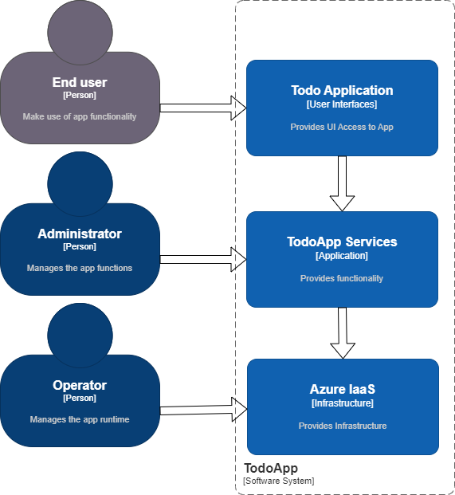
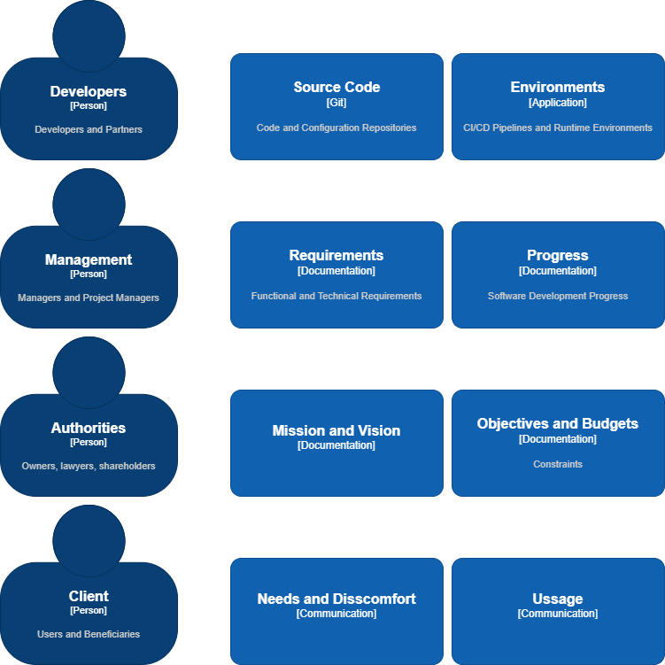

# Todo App Documentation

## Runtime Architecture

### Runtime Architecture Overview

### Actor - Operator

### System - Infrastructure

### Actor - Administrator

### System - Application

### Actor - End User

### System - User Interface

## Organization Architecture

### Organization Architecture Overview

## Data Model

## Technical Stack

### .NET Aspire

### ASP.NET Core

### gRPC

### Mapperly

### Marten

### OpenApi

### OpenTelemetry

### Wolverine
